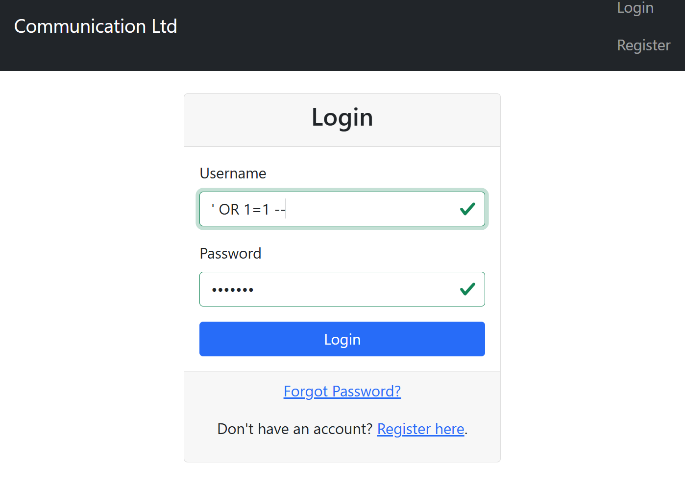
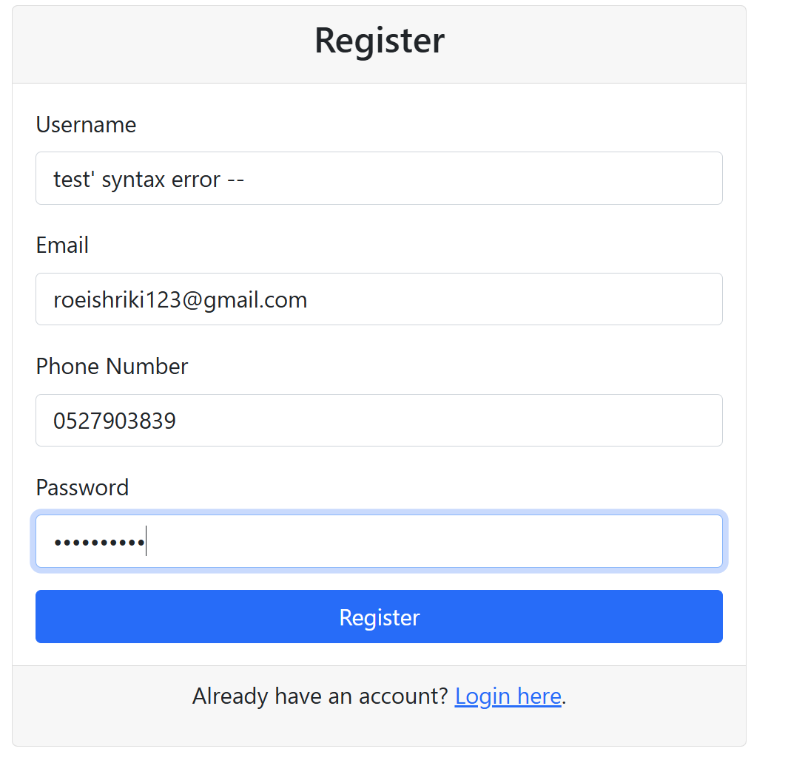
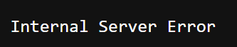
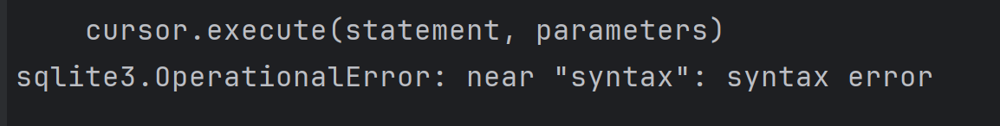
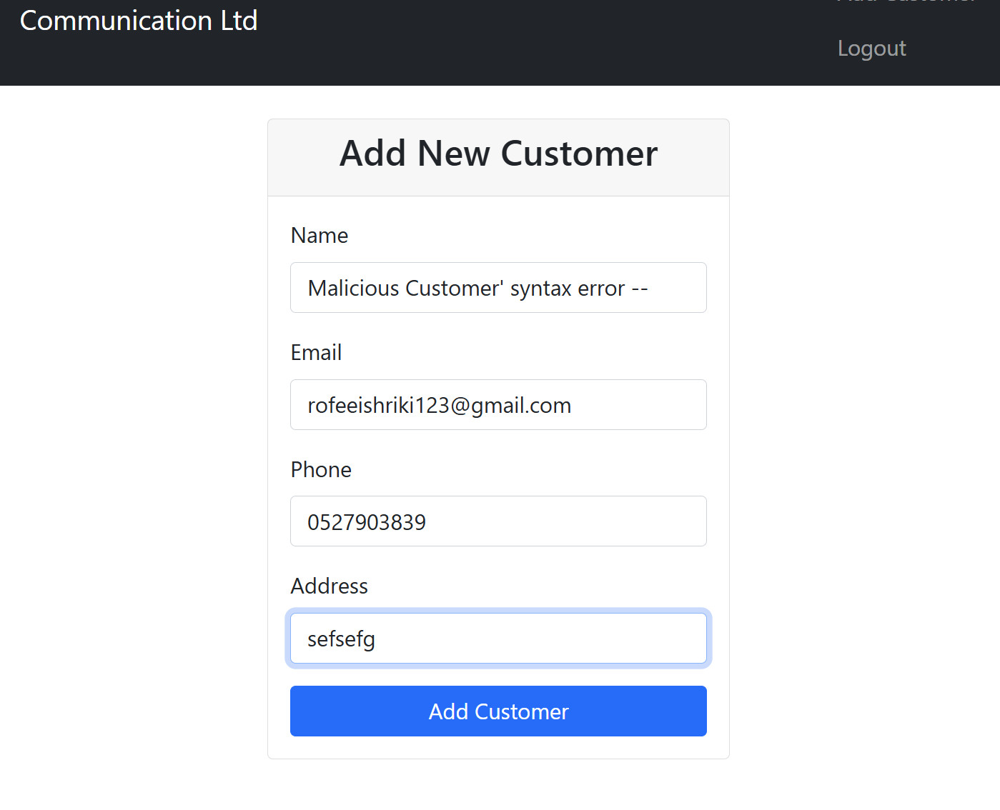
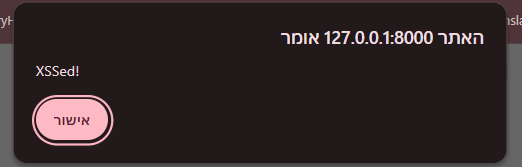
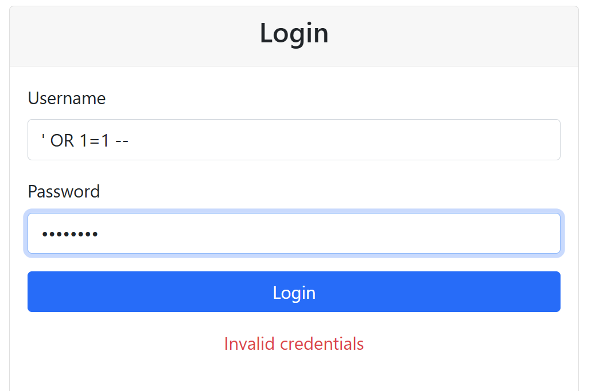
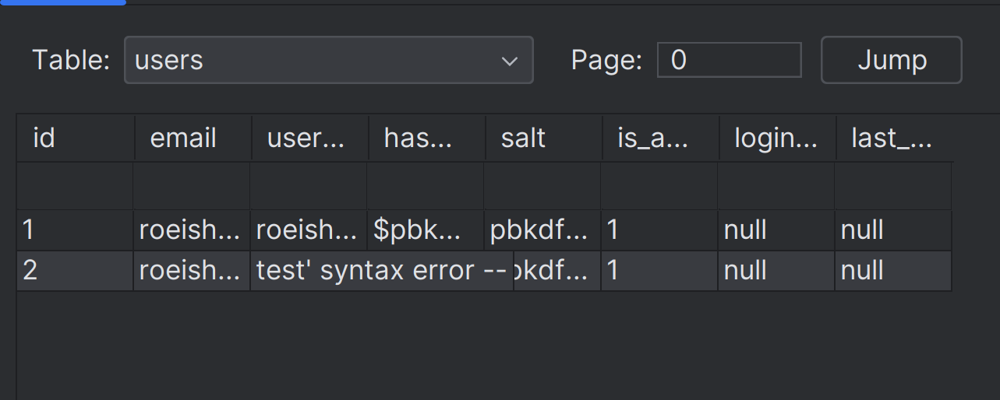
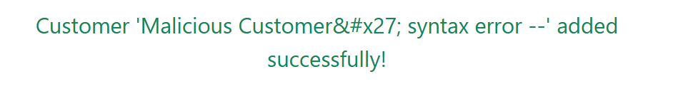
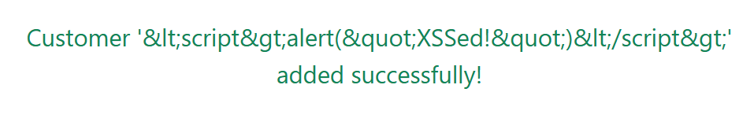

# Communication_LTD Web Application

This project demonstrates a secure web application for Communication_LTD, a fictional telecommunications company, along with a vulnerable version that shows common security issues.

## Project Structure

```
├── secure_main.py          # Secure version of the application
├── vulnerble_main.py       # Vulnerable version for demonstration
├── models.py              # Database models
├── schemas.py             # Pydantic schemas for data validation
├── security.py            # Security utilities and functions
├── database.py            # Database configuration
├── config.py              # Application configuration
├── templates/             # HTML templates
└── requirements.txt       # Project dependencies
```

## Setup

1. Create and activate a virtual environment:
```bash
python -m venv venv
source venv/bin/activate  # On Windows: venv\Scripts\activate
```

2. Install dependencies:
```bash
pip install -r requirements.txt
```

3. Run the secure version: (http://127.0.0.1:8000/secure/)
```bash
uvicorn secure_main:app --reload
```

4. Run the vulnerable version: (http://127.0.0.1:8000/)
```bash
uvicorn vulnerble_main:app --reload
```

## Features

### Secure Version
- User authentication and authorization
- Secure password hashing using PBKDF2 with SHA-256
- JWT token-based authentication
- Customer management system
- Protection against common web vulnerabilities
- Input validation using Pydantic
- SQLAlchemy ORM for database operations

### Vulnerable Version
The vulnerable version demonstrates common security issues:

#### SQL Injection Examples
1. Login Bypass (on `/login`):
   - Input `' OR 1=1 --` into the Username field
   - This bypasses the login check and logs you in as the first user
   - The password field can be left empty as the SQL comment (`--`) will ignore the password check
   - Note: For demonstration purposes, the password is hashed with **SHA-256** before being included in the SQL query. The query is vulnerable to SQL injection.
   

2. Register Syntax Error (on `/register`):
   - Input `test' syntax error --` into the Username field
   - This causes a SQL syntax error, demonstrating the vulnerability
   
   
   

3. Add Customer Syntax Error (on `/add-customer`):
   - Input `Malicious Customer' syntax error --` into the Name field
   - This also causes a SQL syntax error
   
   
   


#### XSS Examples
1. Stored XSS in Add Customer (on `/add-customer`):
   - Input `<script>alert("XSSed!")</script>` into the Name field
   - When the success message is displayed, the script will execute
   

## Security Measures in Secure Version

1. SQL Injection Prevention:
   - Using SQLAlchemy ORM
   - Parameterized queries
   - Input validation with Pydantic

   

   in register page the malicious input was added as a user to the database and didnt triggered an sqli:
   


   in add customer page the malicious input was added as a customer to the database and didnt triggered an sqli:
   


2. XSS Prevention:
   - Input sanitization
   - Output encoding
   - Content Security Policy

      

      


3. Authentication Security:
   - JWT token-based authentication
   - Secure password hashing with PBKDF2-SHA256
   - Token expiration and refresh mechanism

4. General Security:
   - Input validation
   - Error handling
   - Secure session management
   - Rate limiting

## Configuration

The application can be configured through `config.py`:
- Database settings
- Security parameters
- Application settings
- Environment variables

## Dependencies

Key dependencies include:
- FastAPI: Web framework
- SQLAlchemy: Database ORM
- Pydantic: Data validation
- Python-Jose: JWT handling
- Passlib: Password hashing
- Jinja2: Template engine 